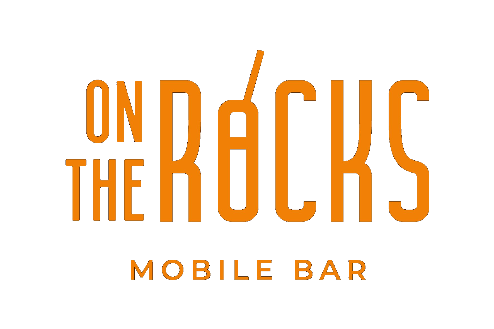

# 🍸 On The Rocks Mobile Bar

Website oficial de **On The Rocks Mobile Bar** — Servicio premium de barra móvil en Richmond, Virginia.



---

## 📋 Información del Proyecto

| Campo | Valor |
|-------|-------|
| **Propietario** | Giovanni Martinez |
| **Negocio** | On The Rocks Mobile Bar |
| **Ubicación** | Richmond, Virginia |
| **WhatsApp** | 804-502-6837 |
| **Email** | ontherocksrva@gmail.com |
| **Instagram** | @ontherocksrva |

---

## 🎨 Identidad de Marca

### Colores
| Color | Hex | Uso |
|-------|-----|-----|
| Midnight Green | `#004E5E` | Color primario, fondos |
| Cadmium Orange | `#F08100` | Acentos, CTAs, highlights |
| Beauty Wine | `#671243` | Acentos secundarios |
| Vivid Auburn | `#A91821` | Sección de paquetes |
| Cultured White | `#F6F6F6` | Texto principal |

### Tipografías
- **Títulos:** Bebas Neue (actualmente usando Montserrat 900)
- **Cuerpo:** Montserrat (400, 500, 600, 700, 900)

---

## 📁 Estructura del Proyecto

```
on-the-rocks-mobile-bar/
├── index.html          # Página principal
├── README.md           # Este archivo (documentación)
├── images/             # Carpeta de imágenes
│   ├── img_01.png      # Logo OTR (Cadmium Orange)
│   ├── img_02.png      # Logo OTR (Nav)
│   ├── img_03.jpg      # Foto Giovanni
│   ├── img_04.png      # Ícono brand
│   ├── img_05-84.jpg   # Fotos de cócteles y galería
│   └── ...
└── assets/             # (futuro) otros recursos
```

---

## 🏗️ Secciones del Sitio

### ✅ Completadas
1. **Hero** — Pantalla completa con logo animado
2. **About** — Foto de Giovanni + estadísticas + íconos de marca
3. **Services** — Barra Móvil Completa, Bartender Profesional
4. **Menu** — Sistema de tabs (Margaritas, Frozen, Paloma, Mojitos, More)
5. **Gallery** — Grid de fotos de cócteles
6. **Packages** — 6 paquetes de eventos:
   - Sweet15 Glam (Quinceañeras)
   - Mimosa Moments (Brunch)
   - Forever Toast (Bodas)
   - Corporate Cheers (Corporativos)
   - Oh Baby! (Baby Showers)
   - Bartender Only
7. **Contact** — Formulario + WhatsApp directo
8. **Footer** — Links sociales

### 🌐 Funcionalidades
- [x] Toggle EN/ES (traduce 43 elementos)
- [x] Botón flotante WhatsApp
- [x] Diseño responsive
- [x] Animaciones CSS

### 🔄 En Progreso / Pendientes
- [ ] Integración de música de fondo
- [ ] Integración Calendly/Google Calendar
- [ ] Facebook Pixel (ID placeholder configurado)
- [ ] Instagram feed embed
- [ ] Portal de clientes (demo creado, falta conectar)

---

## 🔧 Integraciones

### Facebook Pixel
```javascript
// Placeholder - reemplazar con ID real
fbq('init', 'TU_PIXEL_ID');
```

### WhatsApp Business
- Número: +1 804-502-6837
- Link: `https://wa.me/18045026837`

### Calendly (pendiente)
- URL: (por configurar)

---

## 📝 Notas de Desarrollo

### Sesión Actual
- Fecha: (actualizar cada sesión)
- Tarea: 
- Completado:

### Historial de Cambios
| Fecha | Cambios |
|-------|---------|
| Abril 2026 | Migración a GitHub, separación de imágenes |
| Marzo 2026 | Creación de portal de clientes (demo) |
| Febrero 2026 | Sistema de idiomas EN/ES |
| Enero 2026 | Diseño inicial completo |

---

## 🚀 Cómo Usar

### Desarrollo Local
1. Clona el repositorio
2. Abre `index.html` en tu navegador
3. ¡Listo! No necesita servidor

### Despliegue
- **GitHub Pages:** Activar en Settings > Pages
- **Netlify:** Conectar repo y desplegar
- **Hosting propio:** Subir carpeta completa

---

## 📞 Contacto

**Giovanni Martinez**  
On The Rocks Mobile Bar  
Richmond, Virginia

- 📱 WhatsApp: [804-502-6837](https://wa.me/18045026837)
- 📧 Email: ontherocksrva@gmail.com
- 📸 Instagram: [@ontherocksrva](https://instagram.com/ontherocksrva)

---

*Última actualización: Abril 2026*
